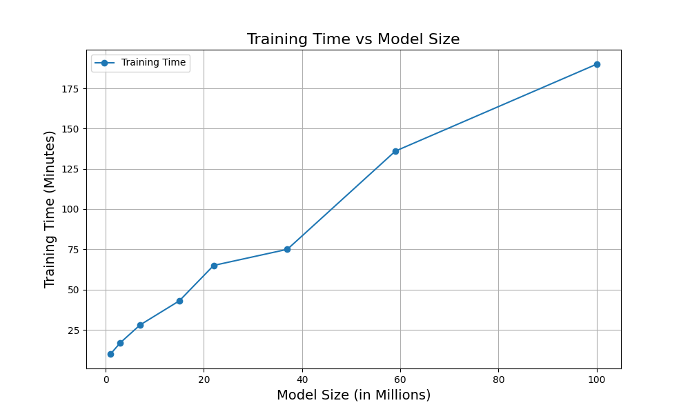
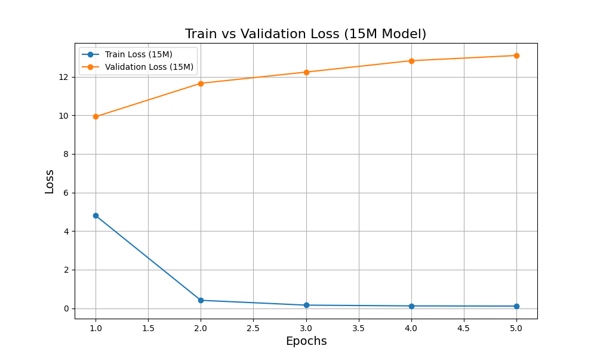
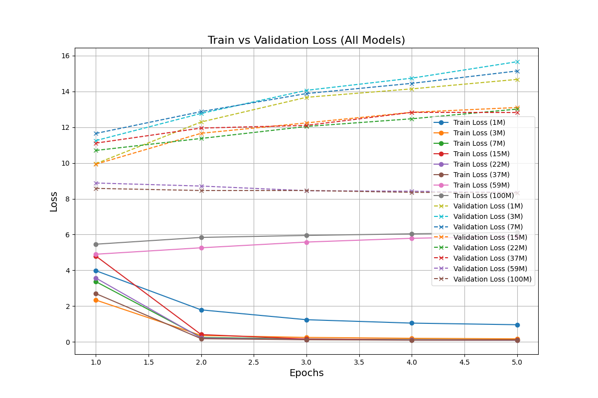

# 🐅 GPT-2 Jungle Book: Training GPT-2 from Scratch 1-100M models

All trained models are hosted on [🤗 Hugging Face](https://huggingface.co/collections/Susant-Achary/gpt2-junglebook-from-scratch-models-6795324c50b62b1ced0d39b5).
---
## 🎯 Goal of the Quick Experiment (5 epochs for each) 

The primary objective of this project is to explore and analyze the impact of model size on text generation quality using GPT-2 architecture trained from scratch on Rudyard Kipling's sample text of *The Jungle Book*. The experiment aims to:

- **Understand Scaling Effects:** Observe how increasing the number of parameters influences text generation performance.
- **Analyze Overfitting:** Assess how model size correlates with overfitting when trained on a small, domain-specific dataset.
- **Document Training Insights:** Provide practical insights into training models from scratch, including resource requirements, training time, and loss trends.
- **Encourage Accessibility:** Share pre-trained models and scripts to help others replicate, improve, or extend the work.
This experiment serves as an hands-on guide and understanding the relationship between model size, dataset size, and text generation quality.


---

## 📚 ** GPT-2-Hugging Face Model Links**

| Model Name       | Parameters | Hugging Face Link                                                              |
|-------------------|------------|-------------------------------------------------------------------------------|
| **1M Parameters** | 1.2M🐰    | [gpt2-jungle-book-1M](https://huggingface.co/Susant-Achary/gpt2-jungle-book-1M) |
| **3M Parameters** | 3.5M🐺     | [gpt2-jungle-book-3M](https://huggingface.co/Susant-Achary/gpt2-jungle-book-3M) |
| **7M Parameters** | 7.8M🐱       | [gpt2-jungle-book-7M](https://huggingface.co/Susant-Achary/gpt2-jungle-book-7M) |
| **15M Parameters**| 15.2M🐶      | [gpt2-jungle-book-15M](https://huggingface.co/Susant-Achary/gpt2-jungle-book-15M) |
| **22M Parameters**| 22.4M🐯      | [gpt2-jungle-book-22M](https://huggingface.co/Susant-Achary/gpt2-jungle-book-22M) |
| **37M Parameters**| 37.6M🦁      | [gpt2-jungle-book-37M](https://huggingface.co/Susant-Achary/gpt2-jungle-book-37M) |
| **59M Parameters**| 59.3M🐘      | [gpt2-jungle-book-59M](https://huggingface.co/Susant-Achary/gpt2-jungle-book-59M) |
| **100M Parameters**| 100.4M🐋    | [gpt2-jungle-book-100M](https://huggingface.co/Susant-Achary/gpt2-jungle-book-100M) |

---

## 📊 **Model Comparison: Text Generation Results**

The models were evaluated using the prompt:  
`Deep in the jungle, Mowgli`

The table below compares the outputs generated by each model: **(5 Epochs was not enough , but still ok to see some results)**

| **Model Size** | **Generated Text**                                                                                                                                     | **Observations**                                                                                                                                          |
|-----------------|--------------------------------------------------------------------------------------------------------------------------------------------------------|-----------------------------------------------------------------------------------------------------------------------------------------------------------|
| **1M**         | Deep in the jungle, Mowgli now knew than. was a burst backed screaming into stand piled, a of rifles and bayetsicked in hisest., theon pr him...       | Highly nonsensical and random text.                                                                                                                       |
| **3M**         | Deep in the jungle, Mowgli dancing thearlog... Mg had learn moneyl in beast the of he not the understand and pl lands the lived but would stop...     | Slight improvement, but still largely incoherent.                                                                                                         |
| **7M**         | Deep in the jungle, Mowgli to sides theine aslaed and at Council... Looklook, be with Pack and hunt the of from village, there he the the the...       | Better structure, but suffers from extreme repetition ("the the the").                                                                                    |
| **15M**        | <mark>Deep in the jungle, Mowgli They no, the of hunted could done She Khan’s hide up up up Sc them the...</mark>                                       | <mark>Improved structure, but repetitive patterns and incomplete sentences remain.</mark>                                                                  || **22M**        | Deep in the jungle, Mowgli who show hisision contempt I for ribs Little! is than else eat What all dancing and such thing but two he...                | Attempts better sentence formation, but still incoherent.                                                                                                 |
| **37M**        | Deep in the jungle, Mowgli own, the accent all Hunting use Hunting use... said the of Bagera and can kill that art enough kill...                     | Severe repetition and nonsensical phrases dominate the output.                                                                                            |
| **59M**        | Deep in the jungle, Mowgliglilili theli the, theli the theli theli theli the, theli theli theli the the, thelig, the, the, theli, theli...             | Overfitted behavior leads to extreme repetition with meaningless tokens.                                                                                   |
| **100M**       | Deep in the jungle, Mowgli,,,,,,,,,,,,,,,,,,,, the,,,,,,,,,,,,,, the,,,                                                                               | Highly overfitted; generates only punctuation and repetitions.                                                                                            |

---

## 📌 **Key Insights**
1. **Best Model Size:**  
   - By Far **15M** model shows the best balance between structure and coherence. Larger models like 59M and 100M heavily overfit due to the limited dataset size.
   
2. **Validation Loss Trends:**  
   - Smaller models exhibit higher validation losses due to underfitting. Larger models stabilize at lower validation losses but produce repetitive outputs.

3. **Recommendations for Improvement:**  
   - Use a **larger and more diverse dataset** (e.g., multiple public domain texts) to improve generalization.
   - Fine-tune pre-trained GPT-2 models rather than training from scratch to save resources and enhance performance.

---
## 📂 **Python Files in the Repository**

Here’s what each Python script does and why it’s included in the repository:

| File Name              | Purpose                                                                                   |
|------------------------|-------------------------------------------------------------------------------------------|
| `data_preparation.py`  | Prepares and tokenizes the dataset (*The Jungle Book*).                                   |
| `train.py`             | Handles the training of models (from scratch and fine-tuning).                           |
| `generate.py`          | Generates text using the trained models.                                                 |
| `config.py`            | Centralized configuration file containing hyperparameters for training and model settings.|
| `utils.py`             | Contains utility functions for logging, saving, and evaluation.                          |

---

## 🌟 **Best Model and Insights**

### **Best Performing Model**
- **Model:** [gpt2-jungle-book-15M](https://huggingface.co/Susant-Achary/gpt2-jungle-book-15M)
- **Reason:** The **15M parameter model** strikes the right balance between training time, vocabulary learning, and dataset size. 
- **Key Observations:**
  - Larger models (e.g., 37M, 59M, 100M) overfit the limited dataset, resulting in repetitive or nonsensical text generation.
  - Smaller models (e.g., 1M, 3M) fail to learn coherent grammar or context.

### **Important Parameters for the Best Model**
| Parameter           | Value           |
|---------------------|-----------------|
| **Embedding Size**  | 512             |
| **Number of Layers**| 8               |
| **Attention Heads** | 8               |
| **Learning Rate**   | 5e-4            |
| **Batch Size**      | 16              |
| **Epochs**          | 5               |

---

## 📊 **Data and Training Details**

### **Dataset Statistics**
| Metric                | Value          |
|-----------------------|----------------|
| **Total Words**       | 53,875         |
| **Unique Words**      | 9,592          |

### **Training Time and Performance**

| Model Size  | Epochs | Training Time (per Epoch) | Total Training Time | Final Train Loss | Final Validation Loss |
|-------------|--------|---------------------------|----------------------|-------------------|------------------------|
| **1M**      | 5      | ~2:02 min                | ~10:10 min          | 0.96              | 14.67                  |
| **3M**      | 5      | ~3:24 min                | ~17:00 min          | 0.17              | 15.66                  |
| **7M**      | 5      | ~5:34 min                | ~27:50 min          | 0.12              | 15.14                  |
| **15M**     | 5      | ~8:31 min                | ~42:35 min          | 0.11              | 13.10                  |
| **22M**     | 5      | ~13:00 min               | ~65:00 min          | 0.09              | 13.01                  |
| **37M**     | 5      | ~18:54 min               | ~75:36 min          | 0.10              | 12.83                  |
| **59M**     | 5      | ~27:16 min               | ~2:16:20 h          | 5.90              | 8.36                   |
| **100M**    | 5      | ~38:07 min               | ~3:10:35 h          | 6.12              | 8.33                   |

---

## 📈 **Visualizations**

### **1. Training Time vs Model Size**


### **2. Train Loss vs Validation Loss (Best Model: 15M)**


### **3. Train Loss vs Validation Loss all models**


---

## 📝 **Conclusion**

- **Best Model:** [gpt2-jungle-book-15M](https://huggingface.co/Susant-Achary/gpt2-jungle-book-15M)
- **Dataset Limitations:** The small dataset size (53,875 words) limits the performance of larger models.
- **Recommendations:**
  1. Use a larger dataset for training larger models.
  2. Fine-tune instead of training from scratch for better results.
  3. Optimize tokenization and add subword vocabularies for limited datasets.

---

## Requirements

```python
transformers==4.34.0
torch==2.1.0
torchvision==0.15.0
datasets==2.14.1
tqdm==4.66.1
numpy==1.25.0
accelerate==0.22.0
huggingface-hub==0.17.0
scipy==1.11.2
tokenizers==0.14.1
```

## 🛠 Folder Structure
```
📂 GPT2-for-Jungle-Book
├── 📂 data                          # Dataset and preprocessed files
│   ├── jungle_book.txt              # Original Jungle Book text
│   ├── train_data.pt                # Preprocessed training data
│   ├── val_data.pt                  # Preprocessed validation data
├── 📂 scripts                       # Python scripts for different tasks
│   ├── data_preparation.py          # Dataset cleaning and preprocessing
│   ├── train.py                     # Training script for all model sizes
│   ├── generate.py                  # Script for text generation
│   ├── upload_to_hf.py              # Script to upload models to Hugging Face
│   ├── config.py                    # Centralized configuration file
│
├── 📂 results                       # Logs, plots, and generated text samples
│   ├── vtraining_time_vs_model_size.png     
|   ├── training_time_vs_model_size.png
│   ├── train_vs_val_loss_all_models.png
├── 📜 requirements.txt              # Python dependencies
├── 📜 README.md                     # Project documentation
```


## 🛠 **How to Generate Text**

You can use the `generate.py` script to generate text with the trained models:

```bash
python generate.py --model_name "15M" --prompt "Deep in the jungle, Mowgli"
```

## 🌍 **Logistics Stuff**

- Dataset: *The Jungle Book* by Rudyard Kipling (Public Domain).
- Framework: Hugging Face Transformers.
- Compute: Kaggle T4 GPUs.
